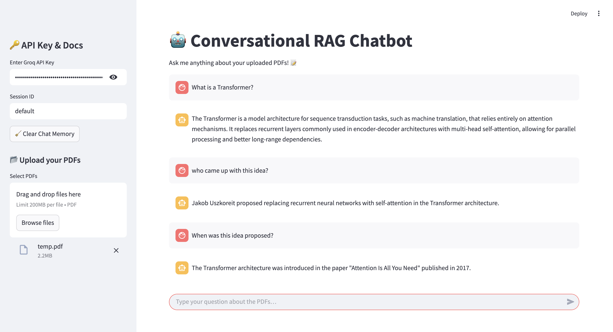

# 🤖 PDF Insights: An Intelligent Conversational RAG Assistant

A conversational AI assistant powered by **LangChain + Groq + Chroma** that intelligently answers questions about your **uploaded PDFs** using Retrieval Augmented Generation (RAG).  
Built with **Streamlit** for a seamless, chat-like user interface.

---

## 🚀 Features

- Upload multiple PDFs and query them conversationally
- Retrieval Augmented Generation (RAG) pipeline with document chunking & embeddings
- Uses Chroma as vector store with persistent storage
- Supports session memory (chat history per session)
- Powered by Groq's LLMs + Hugging Face embeddings
- Clean, responsive Streamlit chat UI with message bubbles

---

## 🛠️ Tech Stack

- [Streamlit](https://streamlit.io/) — UI Framework
- [LangChain](https://www.langchain.com/) — LLM chaining & RAG pipelines
- [Chroma](https://docs.trychroma.com/) — Vector store for document retrieval
- [Groq LLMs](https://console.groq.com/) — Fast inference backend
- [Hugging Face Embeddings](https://huggingface.co/) — Text embeddings (e.g., `all-MiniLM-L6-v2`)
- [PyPDFLoader](https://python.langchain.com/docs/modules/data_connection/document_loaders/pdf) — PDF parsing

---

## 📸 Demo Screenshot

<p align="center">
  
</p>

---

## ⚙️ Setup Instructions

### 1️⃣ Clone the Repository
```bash
git clone https://github.com/yourusername/conversational-rag-chatbot.git
cd conversational-rag-chatbot
```

### 2️⃣ Install Requirements
It is recommended to use a virtual environment.

```bash
pip install -r requirements.txt
```

> ✅ Make sure to install versions compatible with LangChain & Chroma:
> - `langchain==0.1.14`
> - `chromadb==0.4.24`

### 3️⃣ Configure `.env` file

Create a `.env` file in the root directory:

```dotenv
HF_TOKEN=your_huggingface_token_here
```

You can get a free HuggingFace token from [here](https://huggingface.co/settings/tokens).

### 4️⃣ Run the App
```bash
streamlit run app.py
```

---

## 🔑 Authentication

- Enter your **Groq API Key** in the sidebar before starting chats.
- Upload your **PDF files** from the sidebar uploader.
- Start chatting with the bot in natural language!

---

## 💾 Vector Store Persistence

- Uses **Chroma DB** with `./chroma_db` folder for vector storage.
- Ensures PDF embeddings persist across sessions.
- You can clear chat memory using the **🧹 Clear Chat Memory** button.

---

## 📂 Project Structure

```
├── app.py                # Streamlit app (main entry)
├── requirements.txt
├── .env                  # API keys (HF_TOKEN)
├── chroma_db/            # Persisted vector database
├── screenshot.png        # App screenshot
└── README.md
```

---

## 🔥 Sample Models Used

- **Embeddings**: `all-MiniLM-L6-v2` (via Hugging Face)
- **LLM**: `Gemma2-9b-It` (served via Groq)

---

## 🙏 Acknowledgements

- [LangChain](https://www.langchain.com/)
- [Groq LLMs](https://groq.com/)
- [Chroma Vector DB](https://trychroma.com/)
- [Streamlit](https://streamlit.io/)

---

## 🛡️ License

This project is licensed under the [MIT License](LICENSE). Feel free to use, modify, and share with attribution.

---
## 📢 Connect with Me

Let's collaborate! Connect with me on:

[](https://www.linkedin.com/in/v-rithul-06b5632b6/)  

🚀 **Happy Coding!**
